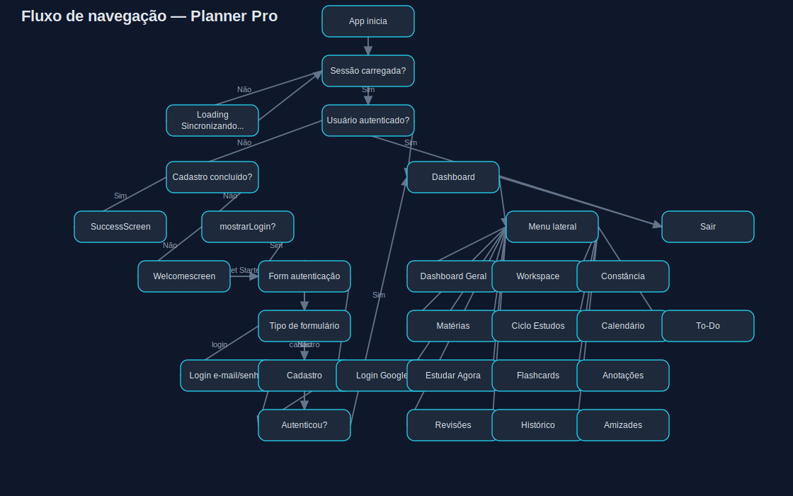

# Diagrama de fluxo de navegação — Planner Pro

Abaixo está o **diagrama visual** do fluxo de navegação do site Planner Pro:

## Fonte do fluxo

Este fluxo foi mapeado a partir de:

- `src/App.jsx` (entrada, autenticação e transição para dashboard);
- `src/components/Dashboard.jsx` (menu lateral e abas internas).

## Leitura rápida

- Usuário sem sessão passa por **Welcome/Login/Cadastro**;
- Usuário autenticado entra no **Dashboard**;
- O **menu lateral** direciona para as abas: Dashboard Geral, Workspace, Constância, Matérias, Ciclo, Calendário, To-Do, Estudar Agora, Flashcards, Anotações, Revisões, Histórico e Amizades;
- Em **Sair**, o app faz `signOut()` e retorna ao fluxo não autenticado.
